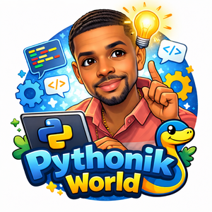

# CSC256 Weekly Sprint Reflections 💡

## Purpose of This Reflections Feed

This folder contains my **weekly sprint reflections** for CSC256.  
The goal of these reflections is not to restate assignment instructions or summarize code line-by-line, but to **document my learning process as it actually happened**.

These reflections capture:
- what concepts initially confused me
- how I worked through uncertainty and ambiguity
- what finally “clicked”
- and how each sprint changed the way I think about software development

In short, this feed exists to show **growth**, not just completion.

---

## Why Weekly Reflections Matter

Software development is not just about writing working code — it’s about:
- understanding *why* a solution works
- recognizing patterns across projects
- learning how to debug thinking, not just syntax
- becoming more comfortable with uncertainty

These reflections act as:
- a learning log
- a problem-solving record
- and a personal knowledge base I can revisit later

They also help me connect:
- theory → practice  
- user stories → real implementation  
- tests → design decisions  

---

## What You’ll Find Here

Each sprint reflection typically includes:
- initial challenges and misconceptions
- how I interpreted the user stories
- architectural or design decisions I had to make
- testing strategies and tools used
- mistakes, corrections, and lessons learned
- how the sprint changed my understanding of the system

The tone is intentionally honest — not everything works the first time, and that’s part of the learning process.

---

## Sprint Index

- **Sprint 1 – Foundations, Flask App Factory & TDD**  
  Focus: project setup, API basics, pytest, and learning to build from requirements rather than instructions.

*(Future sprints will be added weekly as development continues.)*

---

## Final Note

This reflection feed represents my transition from:
> “following steps to complete labs”  
to  
> “thinking like a developer building a system.”

The goal is progress, not perfection. 
